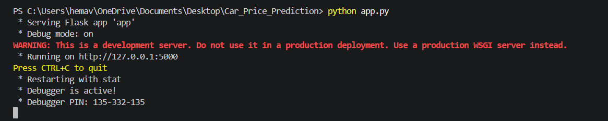
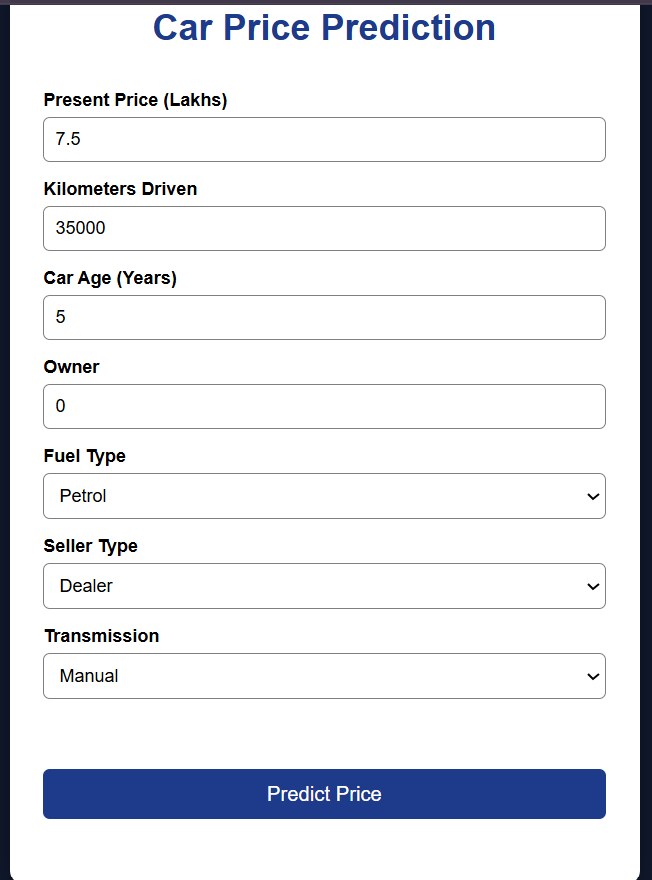
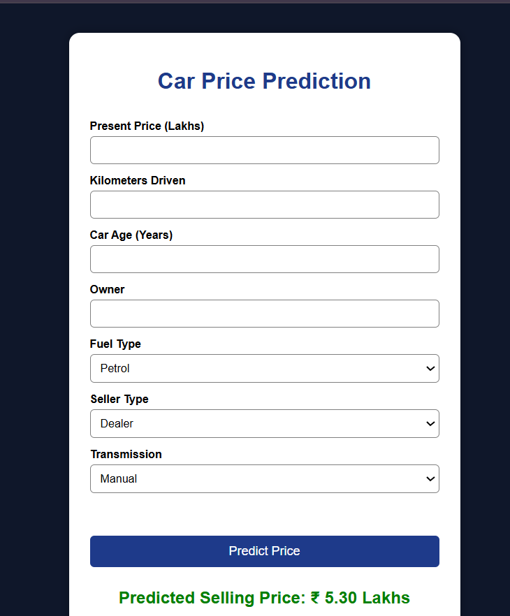
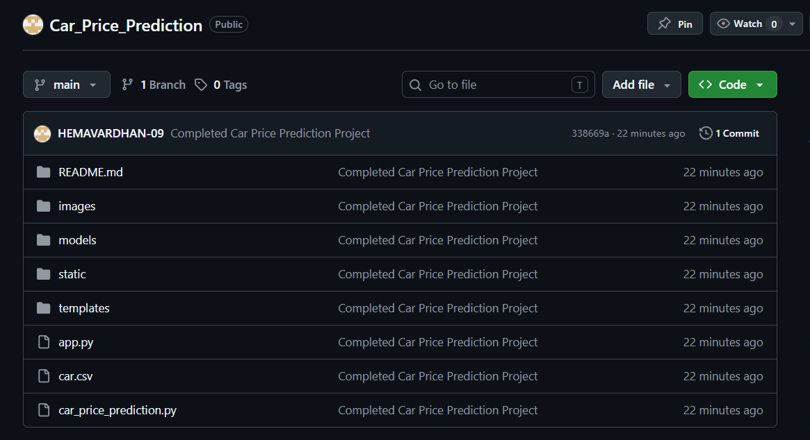

# 🚗 Car Price Prediction using Machine Learning

## 📌 Project Description

This project predicts the selling price of a used car using Machine Learning algorithms. The model is trained on historical car data and deployed as a web application using Flask.

## 🎯 Objective

To predict the selling price of a used car based on:
- Present Price
- Kilometers Driven
- Car Age
- Owner
- Fuel Type
- Seller Type
- Transmission

## 🛠 Technologies Used

- Python
- Pandas
- NumPy
- Matplotlib
- Seaborn
- Scikit-learn
- Flask
- HTML
- CSS

## 📂 Dataset

The dataset contains information about used cars and their selling prices.

## 📊 Machine Learning Models Used

- Linear Regression
- Decision Tree Regressor
- Random Forest Regressor
- Gradient Boosting Regressor

## 📈 Evaluation Metrics

- MAE
- MSE
- RMSE
- R² Score

## 💻 Features

- Data Preprocessing
- Exploratory Data Analysis
- Feature Engineering
- Model Training
- Model Evaluation
- Flask Web Application
- Car Price Prediction

## 🚀 How to Run

1. Install the required libraries:

```bash
pip install -r requirements.txt
```

## 📸 Project Screenshots

### Home Page


### Input Data


### Prediction Result


### GitHub Repository



immediately after:

```bash
pip install -r requirements.txt
